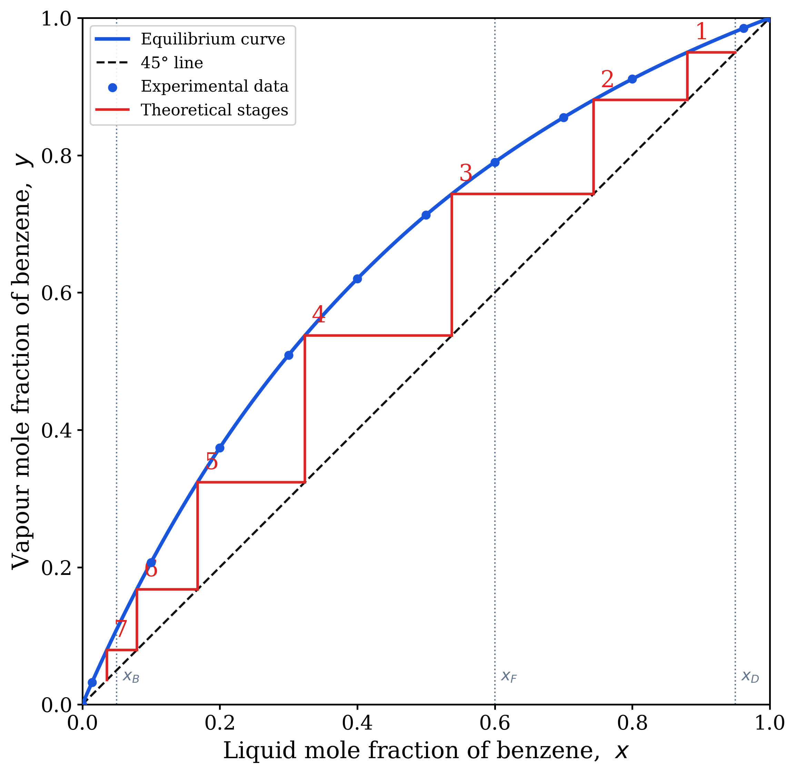
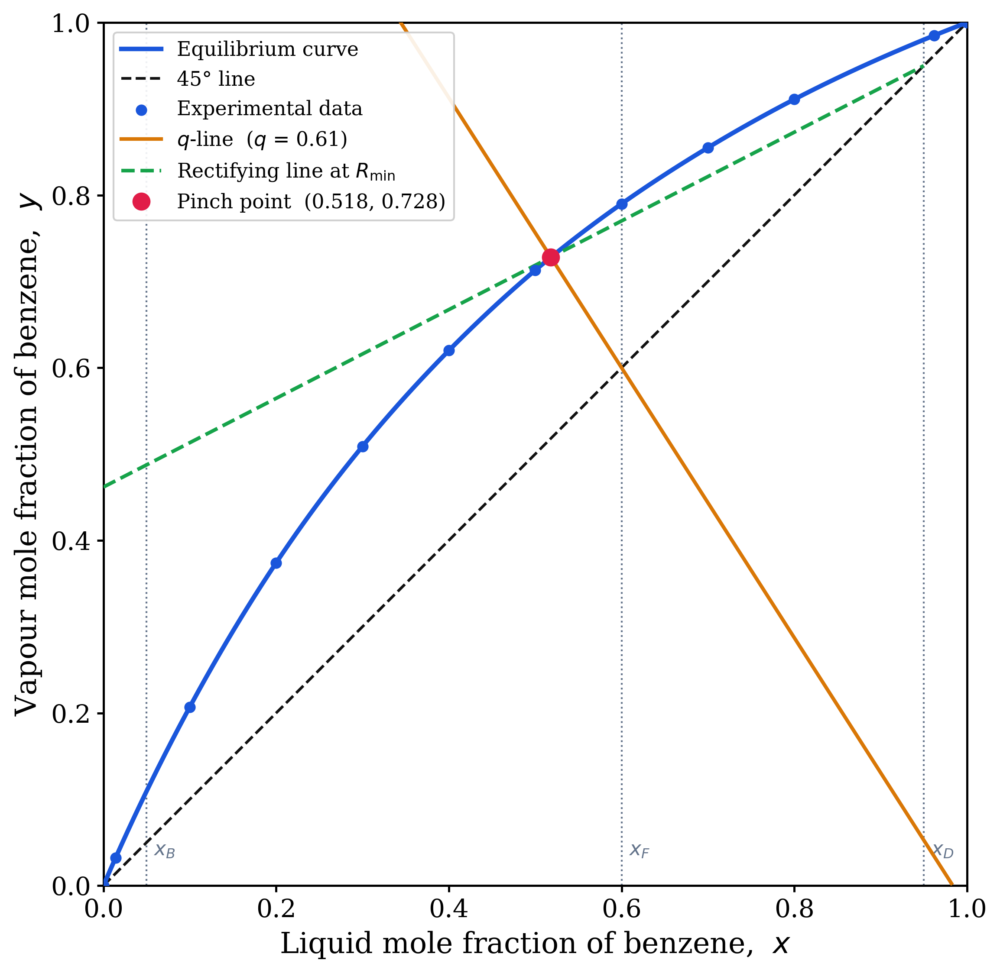
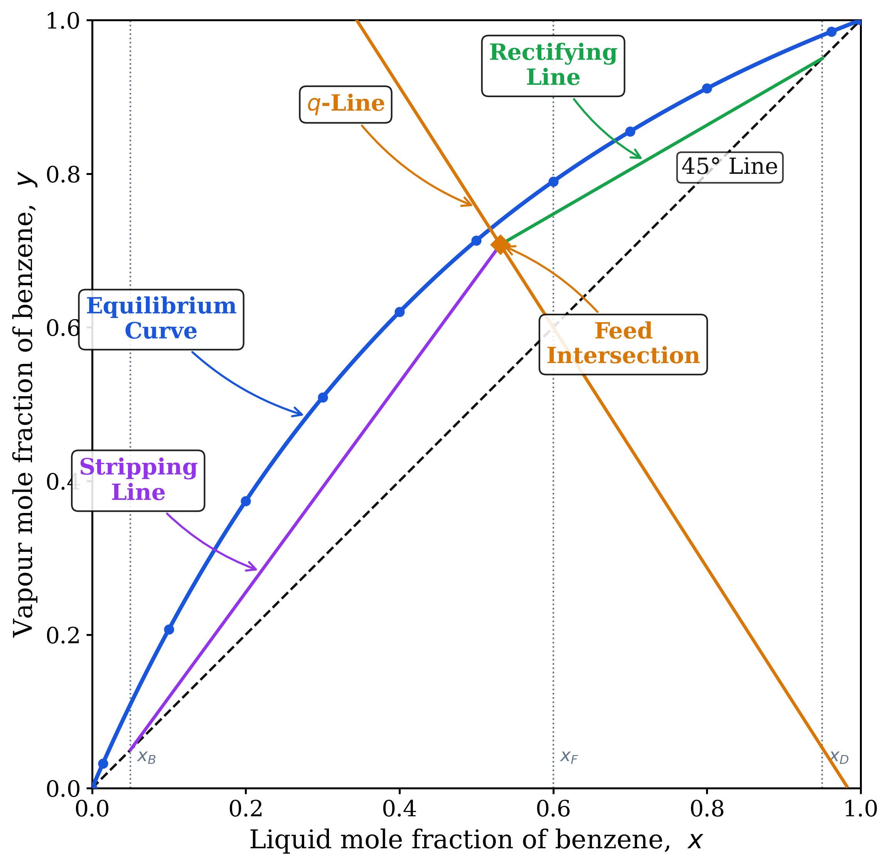
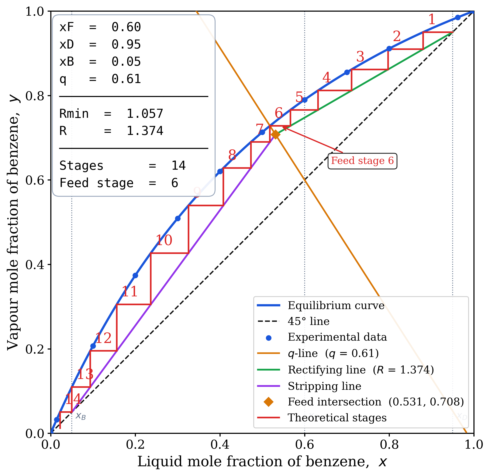

# McCabe-Thiele Distillation Design

McCabe-Thiele graphical method for binary distillation analysis, based on **Example 7.1** from:

> Seader, J.D., Henley, E.J., & Roper, D.K.  
> *Separation Process Principles*, 3rd Edition

---

## System

**Benzene / Toluene** binary distillation at 1 atm, using experimental VLE data from Seader et al., Table 7.1.

| Parameter | Value |
|-----------|-------|
| Feed composition *x*F | 0.60 mol fraction benzene |
| Distillate specification *x*D | 0.95 mol fraction benzene |
| Bottoms specification *x*B | 0.05 mol fraction benzene |
| Feed quality *q* | 0.61 (partially vaporised) |
| Operating reflux | 1.3 × R_min |

---

## Figures

Running `Example7.1.py` generates four publication-quality figures:

| Figure | File | Description |
|--------|------|-------------|
| **A** | `FigA_MinimumStages.png` | Minimum stages at total reflux (Fenske condition) |
| **B** | `FigB_MinimumReflux.png` | Minimum reflux condition — pinch point construction |
| **C** | `FigC_DesignFramework.png` | Building the McCabe-Thiele design framework |
| **D** | `FigD_ActualDesign.png` | Actual operating design with equilibrium stage stepping |

All figures are exported as **PNG (300 dpi)**. Stage coordinates are exported to **`stage_steps.csv`** for use in PowerPoint or other tools.

### Figure A — Minimum Stages


### Figure B — Minimum Reflux


### Figure C — Design Framework


### Figure D — Actual Design


---

## Files

| File | Description |
|------|-------------|
| `Example7.1.py` | Main Python script — runs the full McCabe-Thiele analysis |
| `FigA_MinimumStages.png` | Figure A output |
| `FigB_MinimumReflux.png` | Figure B output |
| `FigC_DesignFramework.png` | Figure C output |
| `FigD_ActualDesign.png` | Figure D output |
| `stage_steps.csv` | Stage-stepping coordinates (auto-generated) |

---

## Requirements

- Python 3.8+
- `numpy`
- `matplotlib`
- `scipy`

Install dependencies:

```bash
pip install numpy matplotlib scipy
```

---

## Usage

```bash
python Example7.1.py
```

Output figures and the CSV file are saved in the same directory as the script.

---

## Method Overview

The **McCabe-Thiele method** is a graphical technique for determining the number of theoretical stages required for a binary distillation. It combines:

- The **vapour-liquid equilibrium (VLE) curve**
- The **45° diagonal** (y = x line)
- The **q-line** (feed condition)
- The **rectifying** and **stripping operating lines**

Stage stepping between the equilibrium curve and the operating lines gives the number of theoretical trays. The four figures step through the analysis progressively — from minimum stages at total reflux, through minimum reflux construction, to the complete design framework, and finally the actual operating design.

---

## Reference

Seader, J.D., Henley, E.J., & Roper, D.K. (2011). *Separation Process Principles: Chemical and Biochemical Operations* (3rd ed.). Wiley.
